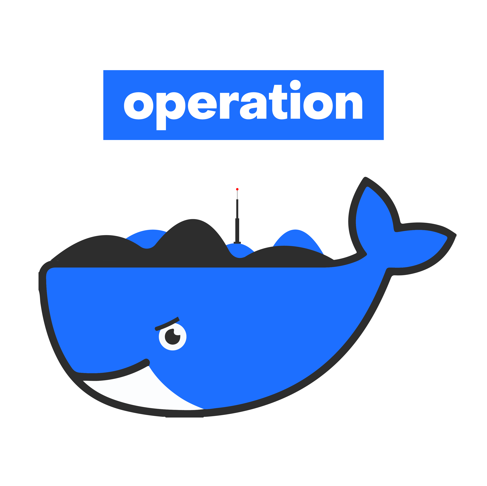

# Operation

<div align="center">

</div>

**Operation** gathers many Docker routines into one place to bring common and simple environments or applications.

From a data science view,  this project was born from several observations :

* It is sometimes difficult to install (and reinstall) tools on your computers.

* It is boring to gather utils we don't really know and we use only occasionally (like split a csv file, reverse an image, etc...).

* It is hard to custom and install other tools without worrying about installation dependencies on your system.

While Docker answers these problems, it still tedious to find, build, historize docker images. Keeping reproducibility in mind.

`operation` brings simple pattern as `operation <operation_name>` to run any operation listed below.

The name "operation" comes from military operations that are defined, operated and then classified : like any Docker container.
It is recommended to know a bit of this technology to better understand and customize your own operations. You can [read the corresponding blogpost](https://towardsdatascience.com/easy-development-environments-with-operation-6b352e72c0eb) to better understand the design and background behind this project.

> This project is inspired by [docker-compose](https://github.com/docker/compose) features but with defined Docker images, a focus on data science tools and more subjective setups. Goal here is not to replace a full workspace but rather to round up common applications with very light setup required : it is bash + docker only.

## Getting started

While it is build with *bash* the only dependency you will need is [Docker](https://docs.docker.com/install/).

Then you can clone this repository and add shortcuts in your terminal :

1. `git clone https://github.com/Ben8t/operation.git`

2. Add the following lines to your shell session script (`.bashrc` or `.zshrc` or `config.fish`, etc...).

    ```bash
    export OPERATION_FOLDER=<installation_path>
    alias operation="${OPERATION_FOLDER}/operation.sh"
    ```

    `<installation_path>` is the full path where you cloned this repository.

    > Tips : you can change the alias by "ops" for your lazy fingers...

3. Run `operation briefing`. It may take a little time while it is building all Docker images. To build only one operation you can run `operation briefing <operation_name>`.

4. Run `operation test` to test the installation. This routine should print "Roger that." in your console.

## :round_pushpin: Operations list

### Python

`operation pybash` or `operation underground`: access a bash environment with python installed. Current workspace is mapped to `/tmp` folder in container.

`operation ipython` or `operation rattlesnake`: launch an [IPython](https://ipython.org/) shell.

`operation jupyter` or `operation neptune`: launch a [Jupyter Notebook](https://jupyter.org/).

### RStudio

`operation rstudio` or `operation paramount`: launch a [RStudio](https://rstudio.com/) session.

### CSV processing

`operation csv-split <file> <chunk_size>`: allow to split a csv file into many parts.

### DuckDuck Go search

`operation search <query>` or `operation mirador`: query to DuckDuckGo engine.

### Shutdown (kill)

`operation shutdown`: clear all operations. WARNING : this will stop/delete all running Docker container too.

### Date processing

`operation date` or `operation chronos`: a tiny command line utility to calculate date and time difference. Based on [pdd](https://github.com/jarun/pdd).

### Image processing

`operation image` or `operation nightbird`: a command line image resizer and rotator for JPEG and PNG images. Based on [imgp](https://github.com/jarun/imgp).

### MLflow

`operation mlflow` or `operation blue_flower`: launch [mlFlow](https://mlflow.org/) user interface from the current folder (must contains an mlruns folder).

### Shellcheck

`operation shellcheck` or `operation white_paper`: check shell script syntax. Based on (shellcheck)(https://github.com/koalaman/shellcheck).

### Report (list)

`operation report`: list all running operation.

## Advanced

It's pretty easy to custom any Dockerfile in this repository and add any operations needed. The folder `operation/src` contains all operations which are defined by a `Dockerfile` and a `config.yml`.

## Artwork

Learning to use Blender during the development of this project so. [More artworks on Behance](https://www.behance.net/gallery/95156933/Operation).

<div align="center">

</div>

---

Copyright © 2020 Benoit Pimpaud

This project is licensed under the MIT license
