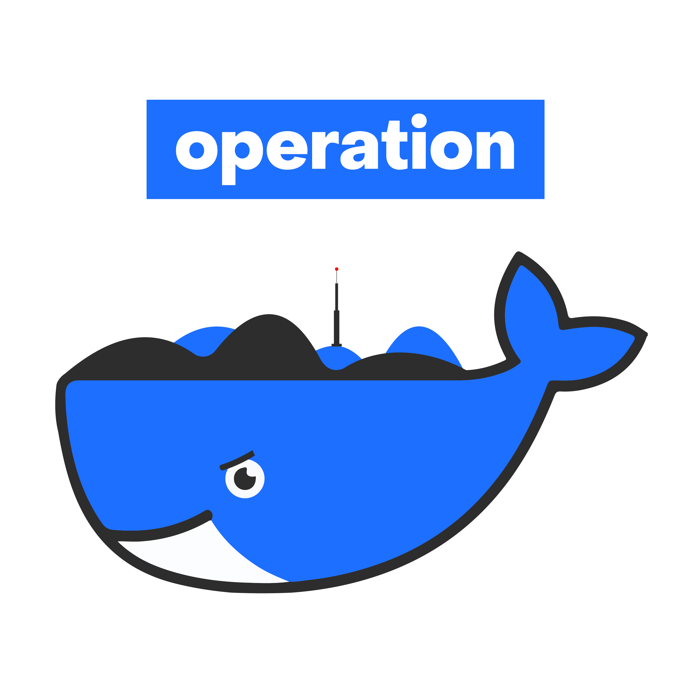

# Welcome to Operation

**Operation** gathers many Docker routines into one place to bring common and simple environments or applications.

From a data science view,  this project was born from several observations :

* It is sometimes difficult to install (and reinstall) tools on your computers.

* It is boring to gather utils we don't really know and we use only occasionally (like split a csv file, reverse an image, etc...).

* It is hard to custom and install other tools without worrying about installation dependencies on your system.

While Docker answers these problems, it still tedious to find, build, historize docker images. Keeping reproducibility in mind.

`operation` brings simple pattern as `operation <operation_name>` to run any operation listed below.

The name "operation" comes from military operations that are defined, operated and then classified : like any Docker container.

It is recommended to know a bit of this technology to better understand and customize your own operations. You can [read the corresponding blogpost](https://towardsdatascience.com/easy-development-environments-with-operation-6b352e72c0eb) to better understand the design and background behind this project.

> This project is inspired by [docker-compose](https://github.com/docker/compose) features but with defined Docker images, a focus on data science tools and more subjective setups. Goal here is not to replace a full workspace but rather to round up common applications with very light setup required : it is bash + docker only.
